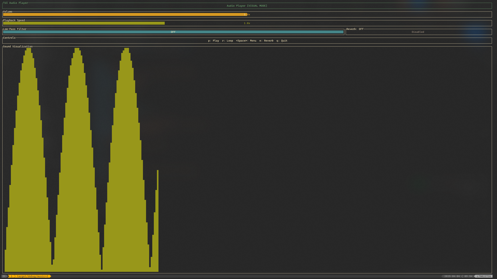

# AudioRust - Terminal-based Audio Player with VIM motions



AudioRust is a terminal-based audio player built in Rust with a Text User Interface (TUI) that offers real-time sound visualization and audio effects. It features a modal interface inspired by Vim/Neovim, making it both keyboard-friendly and highly customizable.

## Features

- **Play and loop audio** files with intuitive controls
- **File browser** for selecting audio files (.wav, .mp3, .ogg, .flac)
- **Real-time audio visualization** with waveform display
- **Multiple audio effects**:
  - Volume control
  - Playback speed/pitch adjustment
  - Low-pass filter
  - Reverb effect
- **Modal interface** with leader key system (Vim/Neovim style)
- **Visual-only mode** that works even without audio devices (perfect for WSL)
- **Terminal UI** with customizable colors and feedback

## Installation

### Prerequisites
- Rust and Cargo (https://rustup.rs/)
- Audio libraries:
  - Linux: ALSA development libraries
    ```
    sudo apt install libasound2-dev
    ```
  - macOS: No additional requirements
  - Windows: No additional requirements

### Building from source

```bash
# Clone the repository
git clone https://github.com/yourusername/audirust.git
cd audirust

# Build and run the application
cargo run --release

# Or just build it
cargo build --release
```

The compiled binary will be at `target/release/audirust`.

## Usage

AudioRust will search for audio files in your current directory. You can use the file browser to navigate and select audio files to play.

### Keyboard Controls

#### Normal Mode
- `p` - Play selected sound once
- `r` - Play selected sound in loop
- `e` - Toggle reverb effect
- `Space` - Open command menu
- `q` - Quit application

#### Command Menu (Press `Space` to activate)
- `v` - Enter Volume Mode
- `c` - Enter Pitch Mode
- `g` - Enter Filter Mode
- `f` - Open File Browser
- `Esc` - Close menu

#### Volume Mode
- `j` / Down Arrow - Decrease volume
- `k` / Up Arrow - Increase volume
- `Esc` - Return to normal mode

#### Pitch Mode
- `j` / Down Arrow - Decrease playback speed
- `k` / Up Arrow - Increase playback speed
- `Esc` - Return to normal mode

#### Filter Mode
- `j` / Down Arrow - Lower the filter cutoff frequency
- `k` / Up Arrow - Raise the filter cutoff frequency
- `Esc` - Return to normal mode

#### File Browser Mode (Press `Space` then `f` to activate)
- `j` / Down Arrow - Navigate down through files and directories
- `k` / Up Arrow - Navigate up through files and directories
- `h` / Left Arrow - Go to parent directory
- `l` / Right Arrow / Enter - Enter directory or play file and return to normal mode
- `p` - Play selected audio file (stay in browser)
- `r` - Loop selected audio file (stay in browser)
- `Esc` - Return to normal mode

## Technical Details

AudioRust is built with:

- [Rust](https://www.rust-lang.org/) - The programming language
- [ratatui](https://github.com/ratatui-org/ratatui) - For the terminal user interface
- [rodio](https://github.com/RustAudio/rodio) - For audio playback and effects
- [crossterm](https://github.com/crossterm-rs/crossterm) - For terminal manipulation

The architecture follows a modular design:
- **Main app**: Controls application flow and event handling
- **Audio player**: Manages audio playback and effects
- **Effect management**: Handles all audio effects in a separate module
- **File manager**: Provides file system navigation and audio file detection
- **UI module**: Renders the terminal interface with file browser and audio visualization

## Compatible Platforms

- Linux
- macOS
- Windows
- WSL (Windows Subsystem for Linux) - Visual mode only

## Features in Development

- [x] ~~File browser for selecting audio files~~ (Implemented!)
- [ ] Playlist support
- [ ] More audio effects (e.g., equalizer)
- [ ] Configuration through config files
- [ ] Custom keybindings
- [ ] Media control key support

## License

This project is licensed under the MIT License - see the [LICENSE](LICENSE) file for details.

## Contributing

Contributions are welcome! Please feel free to submit a Pull Request.

1. Fork the repository
2. Create your feature branch (`git checkout -b feature/amazing-feature`)
3. Commit your changes (`git commit -m 'Add some amazing feature'`)
4. Push to the branch (`git push origin feature/amazing-feature`)
5. Open a Pull Request

## Acknowledgements

- Thanks to the Rust Audio and TUI communities for their excellent libraries
- Inspired by terminal music players like cmus and ncmpcpp
